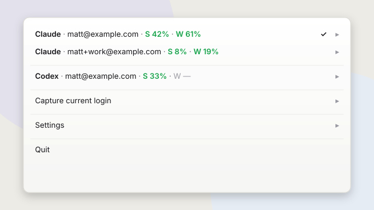
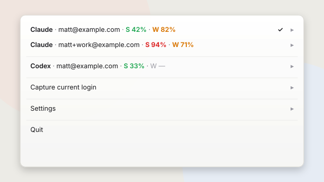
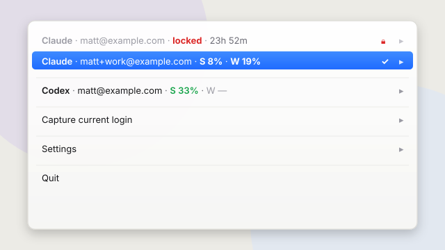

<h1>
  
  claude-usage
</h1>

**See and swap your AI coding CLI quotas from the macOS menu bar.**

MIT &middot; 100% Rust &middot; macOS Menu Bar.

<br clear="left">

[](https://github.com/MattJackson/claude-usage/actions/workflows/ci.yml)
[](https://github.com/MattJackson/claude-usage/releases)
[](https://codecov.io/gh/MattJackson/claude-usage)
[](https://deps.rs/repo/github/MattJackson/claude-usage)

[](LICENSE)
[](https://www.rust-lang.org)
[](README.md)
[](CODE_OF_CONDUCT.md)

---

<table>
  <tr>
    <td width="33%"></td>
    <td width="33%"></td>
    <td width="33%"></td>
  </tr>
  <tr>
    <td align="center"><strong>Healthy</strong></td>
    <td align="center"><strong>Mixed</strong></td>
    <td align="center"><strong>Locked</strong></td>
  </tr>
</table>

## What it does

- **Multi-account per provider** — hold every Claude Max login side-by-side, keyed by email.
- **No-`/login` switching** — swap active accounts in one click; no browser dance.
- **Auto-swap** — drains weekly quota in reset-priority order, so nothing expires unused.
- **15 provider slots today** — Claude and Codex live; 13 more stubbed for the next wave.
- **Free, MIT, single Rust binary** — no webview, no phone-home, no account.

## Install

```sh
brew install MattJackson/tap/claude-usage
claude-usage install     # menu-bar app + auto-swap, now and at every login
```

Upgrades come through Homebrew (`brew upgrade claude-usage`); a running menu-bar app
notices the new binary and relaunches itself into it.

## How it works

Accounts are captured once — you `/login` normally, then `claude-usage capture` copies
those credentials out of the macOS Keychain and stores them locally (`chmod 600`, keyed
by email). Switching just rewrites that single Keychain item back — a new `claude`
session picks up the change; already-running sessions keep their current account until
they restart. Tokens are refreshed automatically before they expire.

Usage numbers come from the same first-party endpoint the `/usage` slash command uses,
authenticated with each account's OAuth token. The daemon polls on a tick and caches
the result — the menu and CLI read that cache, so ordinary use never rate-limits you.

The auto-swap loop watches your active session and moves you off an account before it
hits the wall, preferring the account whose weekly limit resets soonest — so quota
that's about to expire gets spent first, rather than stranded. Hysteresis (cooldown,
no-bounce-back, headroom margin) keeps it from thrashing.

## Details

<details>
<summary><strong>Onboarding accounts</strong></summary>

macOS holds exactly one Claude login in the Keychain at a time. So you log in as an
account, capture it, then log in as the next and capture that.

```sh
claude              # /login as account A, back to the prompt
claude-usage capture          #  ->  Captured you@work.com

claude              # /login as account B
claude-usage capture          #  ->  Captured you@personal.com

claude-usage                  # see everything
```

From the menu-bar app you never need the terminal: `claude` → `/login` → click the
icon → **Capture current login…**. `capture` reads the email of whoever is currently
logged in; capturing an existing email refreshes it rather than duplicating.

</details>

<details>
<summary><strong>Menu-bar app</strong></summary>

`claude-usage menubar` is the primary interface — a status-bar item showing the
active account's session % at a glance. Click it for a dropdown:

- **One submenu per account**, ordered by swap priority (next-best on top,
  maxed-out sinks). Active account is bold; percentages colour amber ≥80%, red ≥95%.
  Each opens: **Switch to this account**, a stats block (`Session X% · resets in …`,
  `Weekly X% · resets in …`, Opus if present, `updated Xm ago`), and **Remove…**.
- **Auto-swap at high usage ▸ Off / 90% / 95% / 98%**, plus **Switch to best account now**.
- **Capture current login…**
- **Launch at login** (toggle)
- **Quit**

`claude-usage install` registers a `launchd` agent so it starts at every login
(Dock-less — menu bar only). `claude-usage uninstall` removes it.

</details>

<details>
<summary><strong>CLI reference</strong></summary>

Accounts are selected by email or a unique prefix (an ambiguous prefix lists matches).

```
claude-usage                     Show usage for every account (default)
claude-usage capture             Capture the account you're currently logged into
claude-usage switch [acct]       Make <acct> the active login (no launch)
claude-usage start [acct]        Switch, then launch a fresh `claude`
claude-usage continue [acct]     Switch, then launch `claude --continue`
claude-usage token <acct>        Print a fresh access token (for scripting)
claude-usage rm <acct>           Forget an account
claude-usage menubar             Run the menu-bar app
claude-usage watch               Headless auto-swap (foreground, no menu bar)
claude-usage install|uninstall   Run / stop the menu-bar app at every login
claude-usage report              Usage patterns by weekday / hour / account
claude-usage --version
```

With no `[acct]`, `switch` / `start` / `continue` auto-pick the account that has
room and whose weekly limit resets soonest.

</details>

<details>
<summary><strong>Auto-swap details</strong></summary>

- **Reactive.** When the active account crosses your threshold (default 95%),
  swap to another with room.
- **Proactive flip-back.** When a spent account's 5h session resets, return to
  it to keep draining its weekly — as long as it's still the best account to be on.
- **Hysteresis.** Only swap to an account whose session has room to spare; a swap
  cooldown; no bounce-back within a short window; a headroom margin on
  near-equal accounts to stop ping-ponging.

If no account has room, it notifies you of the soonest reset instead of swapping.

</details>

<details>
<summary><strong>From source</strong></summary>

```sh
git clone https://github.com/MattJackson/claude-usage.git
cd claude-usage
cargo build --release
cp target/release/claude-usage /usr/local/bin/
```

</details>

<details>
<summary><strong>Security</strong></summary>

- Report vulnerabilities privately via [SECURITY.md](SECURITY.md).
- Tokens live locally in `~/.config/claude-usage/state.json` (owner-only, `0600`)
  and the macOS Keychain, accessed via the `security` CLI. Tokens are never logged.
- Same public OAuth client id as the official Claude Code CLI; tokens are sent only
  to Anthropic's own endpoints.
- If `ANTHROPIC_API_KEY` is set, Claude Code uses that and ignores the Keychain
  login — account switching won't take effect until it's unset.

</details>

> **Unofficial.** Not affiliated with, endorsed by, or supported by Anthropic. Talks
> only to the same first-party endpoints the official Claude Code CLI uses, with the
> same public OAuth client id. **macOS only** (relies on the macOS Keychain and
> `launchd`). Use at your own risk.

## Contributing

Contributions welcome — see [CONTRIBUTING.md](CONTRIBUTING.md) and
[CODE_OF_CONDUCT.md](CODE_OF_CONDUCT.md). Release notes in [CHANGELOG.md](CHANGELOG.md).

## License

MIT — see [LICENSE](LICENSE).
